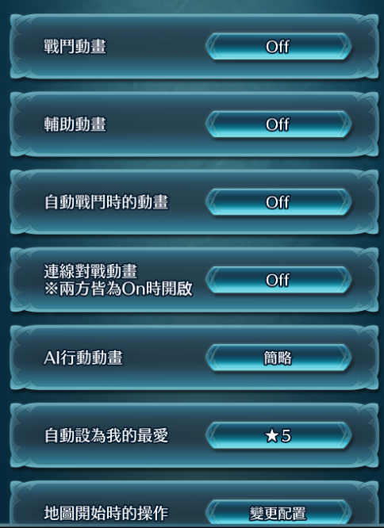
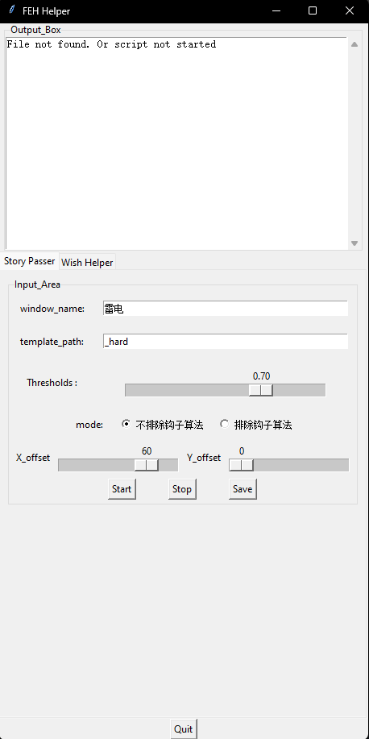
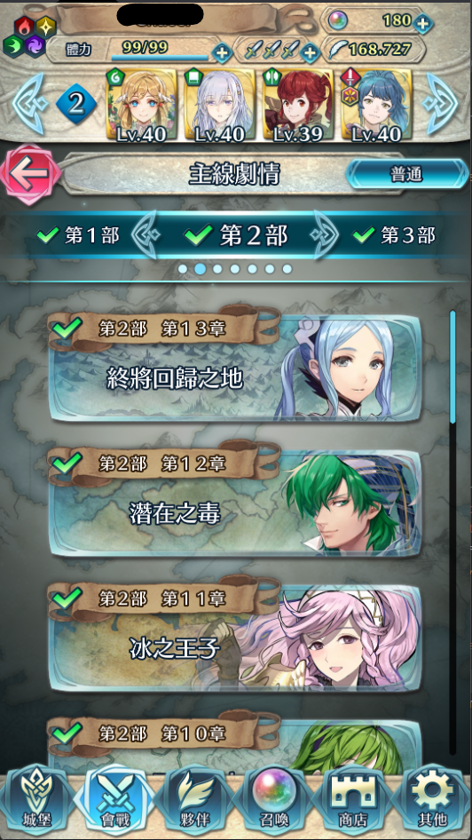
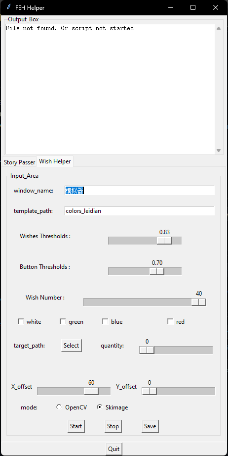
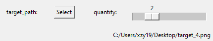
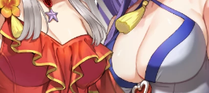

# Fire-Emblem-Hero-Auto-Player
This FEH hero auto helper is a game helper based on python image recognition. It includes two major functions, an auto wishes helper and main story passer. And it comes with an ugly interface for the detailed settings.
Since FEH is a mobile game, you need to select an emulator wisely. In my test environment, i set up a LDPlayer (Andriod 9) and a MuMu Player 12(Andriod 12) in 540P for testing.

Warning! The author is not liable for any direct or indirect losses caused by the use of this project or the inability to use it. This includes, but is not limited to, loss of gems, account bann.

If you find any question while using, welcome to ask me for help

## Folder structure
Videos:
Story passer: [story passer](https://youtu.be/eV_X9Oh1PoE)
Wish helper with skimage: [wish_with_skimage](https://youtu.be/ZQzArMrUYE8)
Wish helper with opencv: [wish_with_opencv](https://youtu.be/k5z8h_GQsJ4)

## Folder structure

- **/logs**: Holds log files generated by the project during runtime. 
- **/finished_wishes**: Records the history of past wishes with screenshots.
- **/config**: Holds configuration files or settings used in the project.(would be created when the program started)
  - **/config/config_loot.ini** Stores the settings for loot help
  - **/config/config_passer.ini** Stores the settings for story passer
- **/pics**: This folder holds the necessary templates for image recognition
  - **/pics/first_level**: Contains the templates for main menu. Since the icon is animated, so you can add different exclamation marks and corner of the icon in the folder for better recognition. 
  - **/pics/second_level**: Contains the templates for second menu, and the same with above one. *Detailed usage would be explained below.*
  - **/pics/loot**: Contains the templates for loot helper
    - **/pics/loot/colors/**: Groups the templates with different colors
      - **/pics/loot/colors/blue_with_pos**
      - **/pics/loot/colors/blue_hide_with_pos**
      - **/pics/loot/colors/green_with_pos**
      - **/pics/loot/colors/green_hide_with_pos**
      - **/pics/loot/colors/red_with_pos**
      - **/pics/loot/colors/red_hide_with_pos**
      - **/pics/loot/colors/white_with_pos**
      - **/pics/loot/colors/white_hide_with_pos**
      - **/pics/loot/back.png**
      - **/pics/loot/close.png**
      - **/pics/loot/close_after.png**
      - **/pics/loot/confirm.png**
      - **/pics/loot/end.png**
      - **/pics/loot/free_summon.png**
      - **/pics/loot/next_summon.png**
      - **/pics/loot/normal_first.png**
      - **/pics/loot/return.png**
      - **/pics/loot/sec_summon.png**
      - **/pics/loot/second_not_free.png**
  - **/pics/aftergame_close.png**
  - **/pics/auto_confirm.png**
  - **/pics/auto_ingame.png**
  - **/pics/backward.png**
  - **/pics/give_up.png**
  - **/pics/haschamp.png**
  - **/pics/main_ticked.png**
  - **/pics/over.png**
  - **/pics/refill.png**
  - **/pics/second_ticked.png**
  - **/pics/skip.png**
  - **/pics/ship_green.png**
  - **/pics/stage_clear.png**
  - **/pics/stage_clear_part.png**
  - **/pics/start_fight.png**
  - **/pics/start_fight_ingame.png**

## Requirements

- pip install pygetwindow
- pip install opencv-python
- pip install pyautogui
- pip install numpy
- pip install scikit-image
- pip install tkinter
- pip install configparser

## How to use it

 Firstly, you need to take screenshots of the major buttons and icons as templates, they are listed in the "Folder structure" part above. I will provide the templates i used for testing in the sample_pics folder, but they may not be useful even if the settings for emulators are the same with me, due to the slightly difference in the interface(some emulator count the sidebar within the resolution and some are not). I strongly suggest to take screenshot by your own and **keep in mind that once if you change the quality of the resources in game**, the previous templates may not work as well.

 Secondly, you need to turn off necessary settings in environment settings. For example, the animations.

---

 After these, you can start to configuration to run the program.

---

> For main story passer, you need to enter the window name depends on the emulator you are using, it doesn't need to be the completed name of the window, you can use the keyword for doing this, but it may consider other window as the emulator for inacurate keywords.
> 
> For the template_path, it was once designed to be the absolute path for the template folder, but i was to lazy to change. So, the template folder is right now fixed to be the under same folder with the code / executable file. But you can use different suffixes for the program to take into different folders for differemt tasks. For example, the default folder is /pics/first_level, and you need to running this for hard difficulty, you may take the screenshots again as templates, and create a /pics/first_level_hard folder to store these. Then you only need to add "_hard" to the template_name entry. Remember, changing this setting does not change the recognition of the buttons, so if you want to change the resolution of the emulator, you need to manully replace the templates under pics folder.
> 
> The slider for threshold is represents the tolerance of how similar the button image in the emulator compares to the template, you can ajust the value based on the running situation.
> 
> The radio buttons below decides the algorithm to check the templates in main and second level menu, the second option would actively reduce the matching results with tick icon, and the first option would not. So the first option may cause the program accidentally select the passed level in game with low threshold, and the second would not recognize the icons correctly with high threshold. Please test and take a suitable threshold in your own environment.
> 
> The last two options give user the ability toi ajust where would the program click on after it gets the cordinates of recognized template. As the image recogniction method may give the coordinates with slightly offset, such as located at the top left corner and the buttons would not be correctly clicked, you can add some offset to correct this.

> After all, you can start to use the tool. you should go to the menu listed below.

It will go through a whole story directly. But you stil need to change to another story manully, as i dont think it would be needed to pass all the story at once. By the way, you need to make sure your team gets strong enough, it will terminate if defeated.

---

For wish helper, the basic logic is the same. But the templat_path should under pics/loot folder. Remember to add your own templates under that folder!

In this scenario, the requirements of the accuracy for recognition of the orbs and the buttons would differ. So, i created two sliders for those two settings

Below, you can enter the basic settings, like what colors of orbs you want and how many wishes you would like to spend.

And if you have a targeted character to go for, you can take a screenshot in the stats confirmation page, and select it in the interface like the image showing above with how many you want. The program would detect how many characters you selected are acquired, it will stop the wishing progress once the number reaches the quantity you needed. Otherwise, it will shut down when the program reaches the limits of wish number.

> For the selection screenshot, as the background in the confirmation page is not the same with the actual wishing interface, you would need to select the part which would be the exactly the same in both pages. i would give an example below.
> 

The last two options is quite the same with story passer, it gives user the ability toi ajust where would the program click on after it gets the cordinates of recognized template. As the image recogniction method may give the coordinates with slightly offset, such as located at the top left corner and the buttons would not be correctly clicked, you can add some offset to correct this.

At the end, the mode options is based on which image recognition package to be use in the program(only for orbs). 
>For openCV, it would not be able to differ white and green with lower threshold(for me, 0.93). On the other hand, i provided an option for skimage method, the weakness of this method would be speed, it would be very very very very slow for processing, but apprently acurrate. 
>
>By using openCV, i would suggest to make the threshold as high as it can recognize things(i was running this with 0.95 and it passed 200 wishes without any mistakes), and it has the advantages to take cover of the animation of the orbs, as you can add orbs images with different animation in the folder and it would process it with acceptable speed.
>
>And for skimage, you can try it with lower threshold compare to openCV(i was using 0.83), as it has a very high accuracy but as the speed is so low you would not be able to add a lot of templates to cover the animation for the orbs. In testing, it has accidentally not able to recognize white as white orb as the template is not shinning one but the screenshot it took contains a shinning white orb while i set the threshold as 0.9. After that i tried more than 120 wishes with 0.83 threshold, it didnt make any mistakes.
